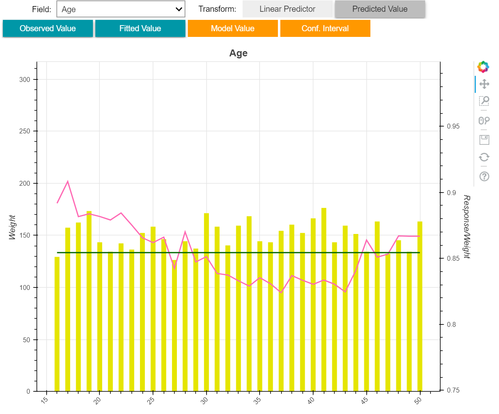
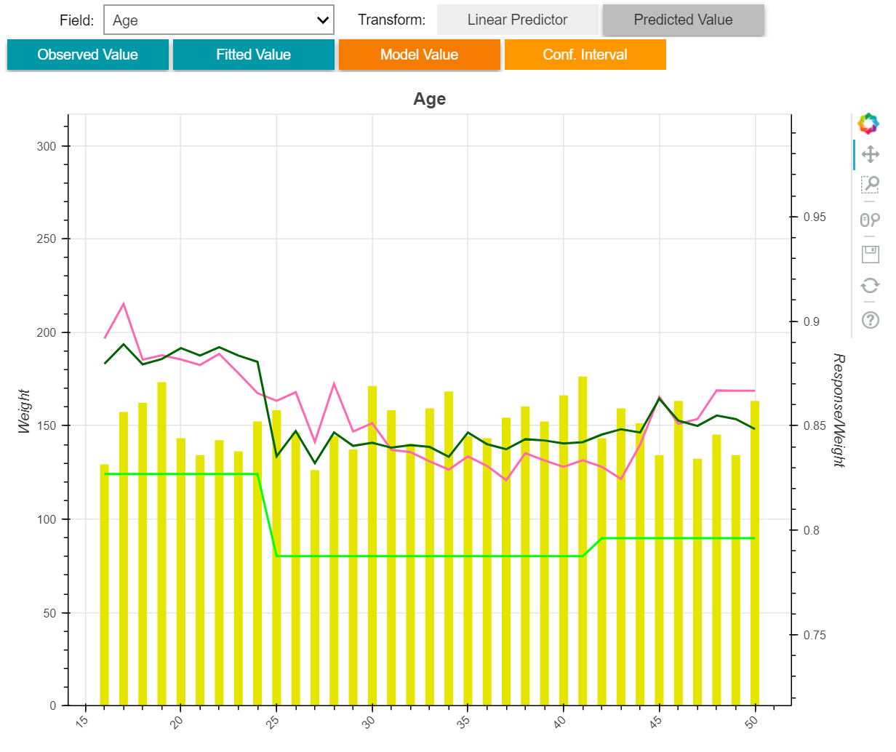
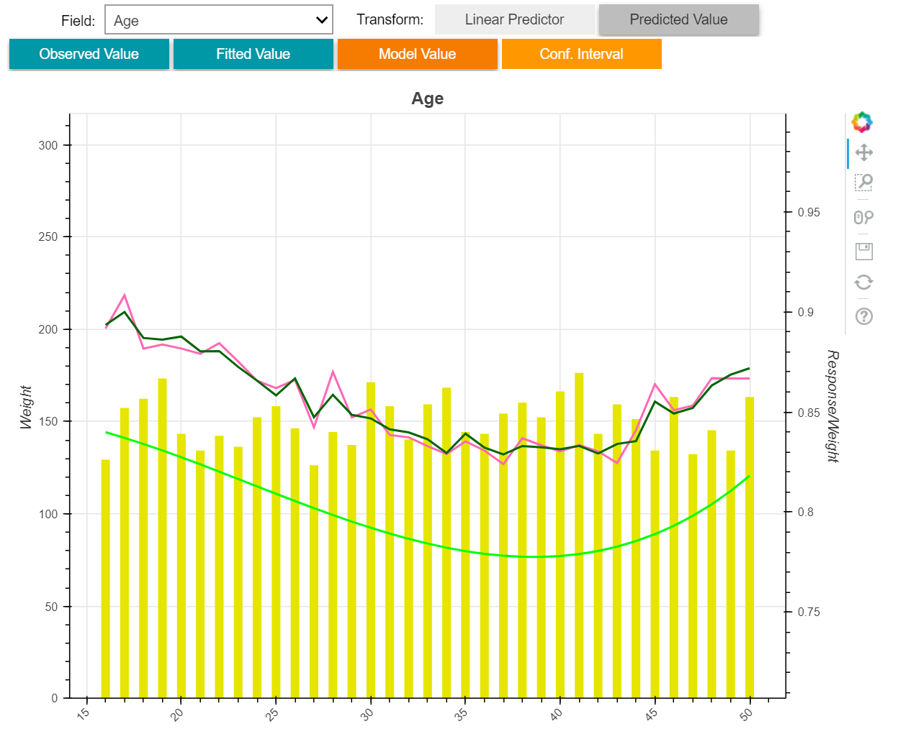
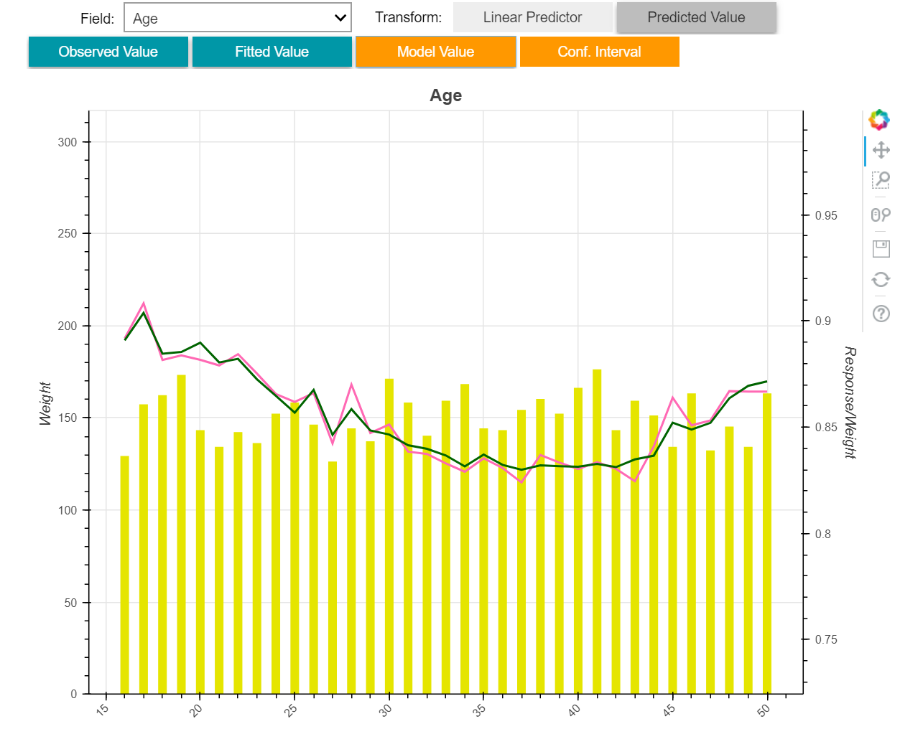
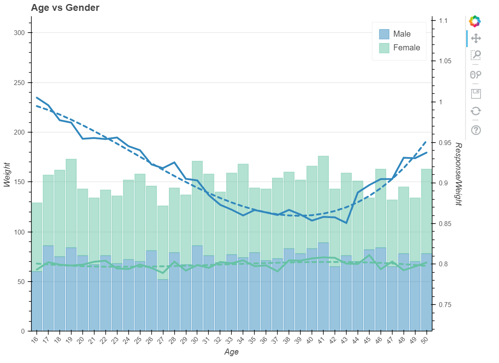

# GLMUtility
GLMUtility is built around statsmodels GLM framework.  It's purpose is to create a quasi-UI in Jupyter to allow for a point-and-click
UI experience.  It is quasi as it still requires writing Python code, but it is heavily abstracted away.

For the P&C actuaries out there, the workflow design is highly inspired by one of the more prominent GLM
GUIs in the industry.

Data prerequisite is that all variables be discrete (i.e. bin your continuous variables).  The utility supports pandas dataframes.

# GLMUtility Example

```python
import pandas as pd
import numpy as np
df = pd.read_pickle('sample.pkl')
```


```python
from GLMUtility import GLMUtility
```


To create a GLM, you need to specify the universe of predictor (or independent) features, a response (or dependent variable), and finally, a weight.


```python
independent = ['Gender','Age']
dependent = 'Response'
weight = 'Weight'
MyGLM = GLMUtility.GLM(data=df,
                       independent=independent,
                       dependent=dependent,
                       weight=weight,
                       scale='X2',
                       family='Poisson',
                       link='Log')
MyGLM.fit()
```

### view() is your UI
Using the view() method, we can toggle one way views of our observed response, our fitted averages, marginal plots of any fitted features, as well as confidence intervals.  In a Jupyter notebook, these buttons and drop downs are
fully functional.


```python
MyGLM.view()
```





### Fitting features is 'simple'


```python
MyGLM.fit(simple=['Gender'])
```

### Custom Factors
A custom factor is an on-the-fly data transformation that we will be using to manage our model fits. Each model feature has various levels and many of these will be insignificant when we fit the raw feature itself as a simple factor.  Rather than recreating our dataset again, we can aggregate levels of a feature together using custom factors.  You can group multiple levels of a feature by using key:value mapping of a python dictionary

- Custom factors can be created by calling the create_custom method on the GLM object:
```python
create_custom(name=<name to assign custom>, column=<source column to apply to>,dictionary=<key:value mapping>)
```


```python
custom_dict = {**{key:1 for key in range(16,25)},
                **{key:2 for key in range(25,42)},
                **{key:3 for key in range(42,51)}}

MyGLM.create_custom(name='Age_c1', column='Age',dictionary=custom_dict)

MyGLM.fit(simple=['Gender'], customs=['Age_c1'])
MyGLM.view()
```





### Variates
For continuous variables, there is a notion that the factor levels have some relational form and should not be treated as discrete independent factors.  To accomodate this, we can employ Variates which will smooth out the factor fits using a polynomial form.  Functionality is identical to custom factors, except there is an additional arguement `degree` to specify the order of the polynomial.

```python
create_variate(name=???, column=???,dictionary=???, degree=???)
```


```python
variate_dict = {key:key for key in np.sort(df['Age'].unique())}

MyGLM.create_variate(name='Age_v1', column='Age',dictionary=variate_dict, degree=3)

MyGLM.fit(simple=['Gender'], variates=['Age_v1'])
MyGLM.view()
```





### Offsets?  No problem
There will be times that we do not want the GLM to compute certain factors, but we want them accounted for in our GLM.  Imagine you've performed a separate analysis (e.g. deductible study) which you want to include in your GLM.  This can be accomplished with **offsets**.  By entering 'known' relativities as offsets, the GLM will solve for all other parameters around those 'known' relativities.  

Creating offsets has similar syntax to custom factors and variates:
```python
create_offset(name = ???, column = ???, dictionary = ???)
```
With offsets, the dictionary values will be the relativities you would like for each factor level.

### But what about interactions?...
Sure why not.


```python
create_interaction(name=<name of interaction>, interaction=[<var1>, <var2>])
```


```python
MyGLM.create_interaction('Age.Gender', ['Age_v1','Gender'])

MyGLM.fit(simple=['Gender'], variates=['Age_v1'], interactions = ['Age.Gender'])
MyGLM.view()
```





### Two way Actual vs Expected
To see interactions more easily, look at the two_way actual vs. expected chart.


```python
MyGLM.two_way('Age','Gender')
```



