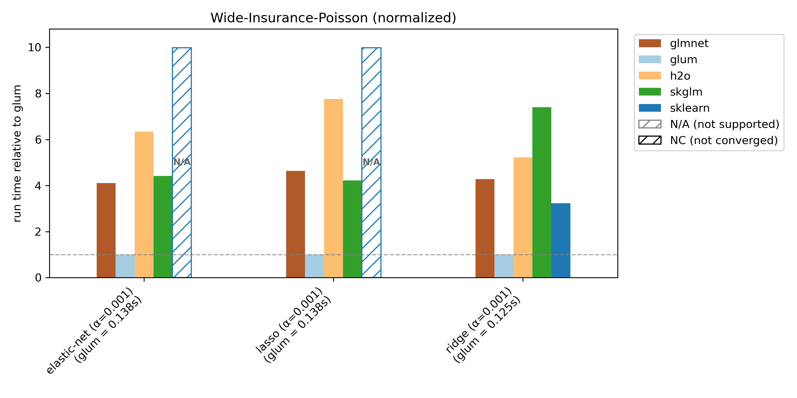
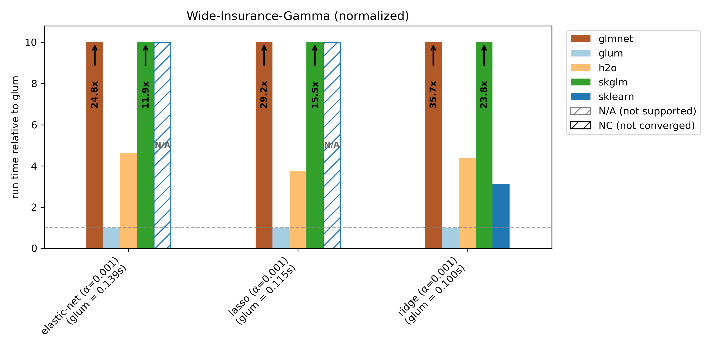
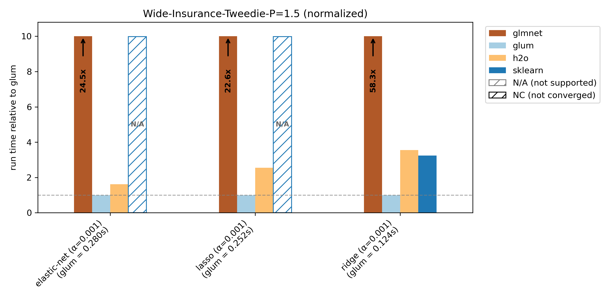
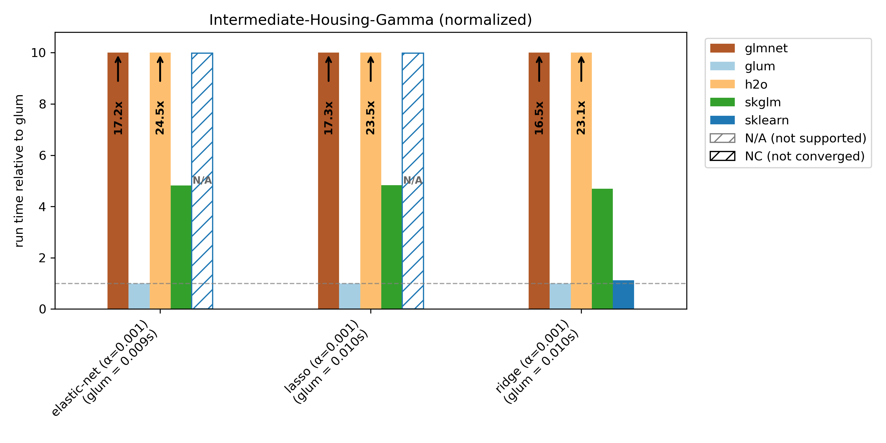
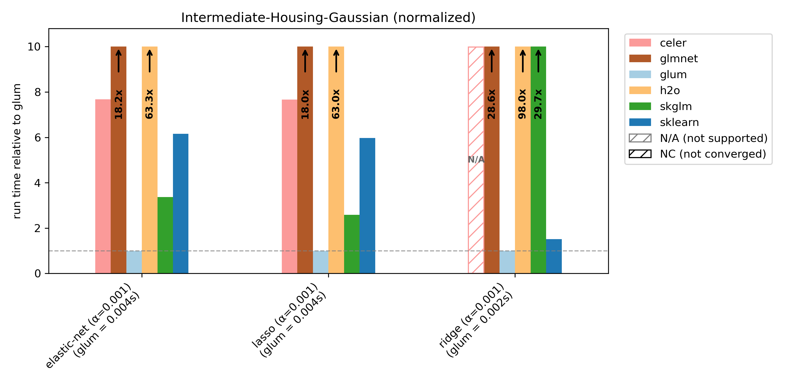
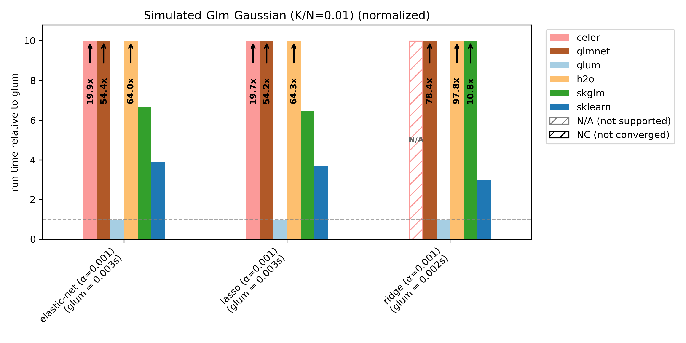
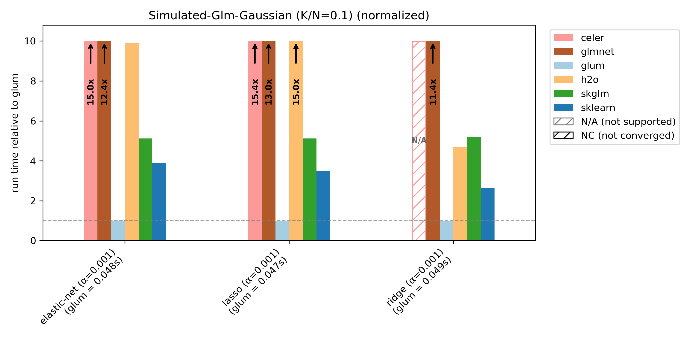
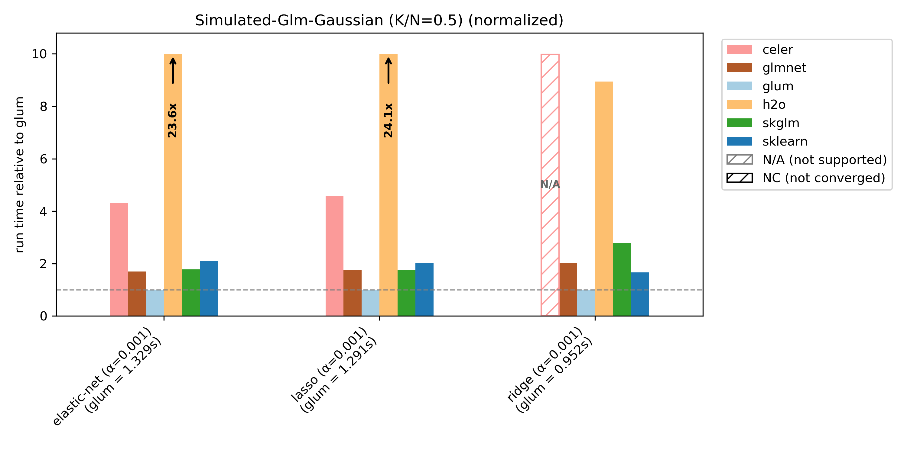
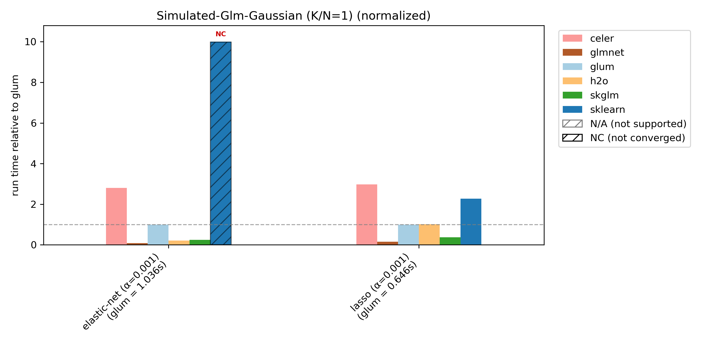
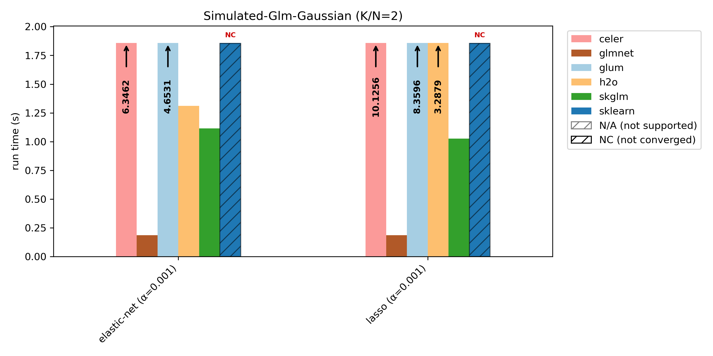

Benchmarks
=================================

The following benchmarks were run on a MacBook Pro laptop with an Apple M4 Max chip.

Each plot title indicates the dataset and distribution used. For example, "Wide-Insurance-Gamma" refers to the ``wide-insurance`` dataset fit with a gamma distribution. Further information about the datasets can be found at the end of the document.

For each dataset/distribution pair, we benchmark three regularization types:

- Elastic net (``l1_ratio=0.5``): ``elastic-net``
- Ridge (``l1_ratio=0.0``): ``ridge``
- Lasso (``l1_ratio=1.0``): ``lasso``

We extract target variables and benchmark them under typical distributions (for example, insurance claim counts using Poisson models).

Runtime plots are reported relative to ``glum``: for each benchmark case, ``glum``'s runtime is normalized to 1.0 and other libraries' runtimes are scaled accordingly. If a bar exceeds the plotting range, the exact runtime is printed on the bar and an arrow indicates truncation.

We compare ``glum`` against ``sklearn``, ``skglm``, ``glmnet``, ``h2o`` and ``celer``. As some libraries do not support all benchmark cases, these combinations are shown as ``N/A`` (not supported). If a library does not converge (either it reaches ``max_iter`` or exceeds the 100s timeout), it is shown as ``NC`` (not converged) at the maximum bar height.

glum was designed for settings with N >> K —that is, many more observations than predictors, apart from high-cardinality categorical features. This regime is well illustrated by the wide-insurance benchmark. For insurance data, we evaluate gamma, Poisson, and Tweedie distributions.

.. BENCHMARK_FIGURES_START

.. BENCHMARK_FIGURES_END

To showcase ``glum’s`` performance on another dataset, we also report results for ``intermediate-housing``, which has N >> K and only numerical (no categorical) features. For this dataset, we benchmark gamma and Gaussian distributions.

.. BENCHMARK_FIGURES_START

.. BENCHMARK_FIGURES_END

``glum`` is primarily optimized for N >> K settings, and is not tuned for N ~ K or N < K. This is illustrated by the simulated benchmark with varying K/N ratios: ``glum`` performs best when N >> K, and relative performance decreases as K/N increases.

For K/N = 2, we include an unnormalized runtime plot, because in the normalized version the ``glmnet`` bar becomes too small to read clearly.

.. BENCHMARK_FIGURES_START

.. BENCHMARK_FIGURES_END

In the following table more information about the used datasets can be found. After filtering for ``ClaimAmountCut > 0`` in the "Wide-Insurance-Gamma" dataset, only about 25,000 rows are left. We, therefore, artificially increase the dataset by sampling with replacement and adding noise. The filter is also why the number of columns after one-hot-encoding is smaller compared to the other distributions on this dataset because some category levels only exist in the dropped rows.

For ``simulated-glm`` we reduce N from 10 000 to 1 000 for K/N = 1 and K/N = 2 in order to speed things up (with N = 10 000 nearly no library converges within the 100s limit).

.. list-table:: Dataset Overview
   :header-rows: 1
   :widths: 30 10 5 5 10 40

   * - (Dataset, Distribution)
     - (N, K)
     - Cat. Columns
     - Num. Columns
     - Columns (OHE)
     - Source
   * - (wide-insurance, poisson), (wide-insurance, tweedie)
     - (600 000, 9)
     - 8
     - 1
     - 322
     - `freMTPL2 <https://www.openml.org/search?type=data&id=41214>`_ + feature engineering/preprocessing
   * - (wide-insurance, gamma)
     - (600 000, 9)
     - 8
     - 1
     - 256
     - `freMTPL2 <https://www.openml.org/search?type=data&id=41214>`_ + feature engineering/preprocessing
   * - (intermediate-housing, poisson), (intermediate-housing, gamma)
     - (21 613, 10)
     - 0
     - 10
     - 10
     - `house_sales <https://www.openml.org/search?type=data&id=42092>`_ + feature engineering/preprocessing
   * - (simulated-glm, gaussian) with K/N = 0.01
     - (10 000, 100)
     - 0
     - 100
     - 100
     - simulated
   * - (simulated-glm, gaussian) with K/N = 0.1
     - (10 000, 1 000)
     - 0
     - 1 000
     - 1 000
     - simulated
   * - (simulated-glm, gaussian) with K/N = 0.5
     - (10 000, 5 000)
     - 0
     - 5 000
     - 5 000
     - simulated
   * - (simulated-glm, gaussian) with K/N = 1
     - (1 000, 1 000)
     - 0
     - 1 000
     - 1 000
     - simulated
   * - (simulated-glm, gaussian) with K/N = 2
     - (1 000, 2 000)
     - 0
     - 2 000
     - 2 000
     - simulated
