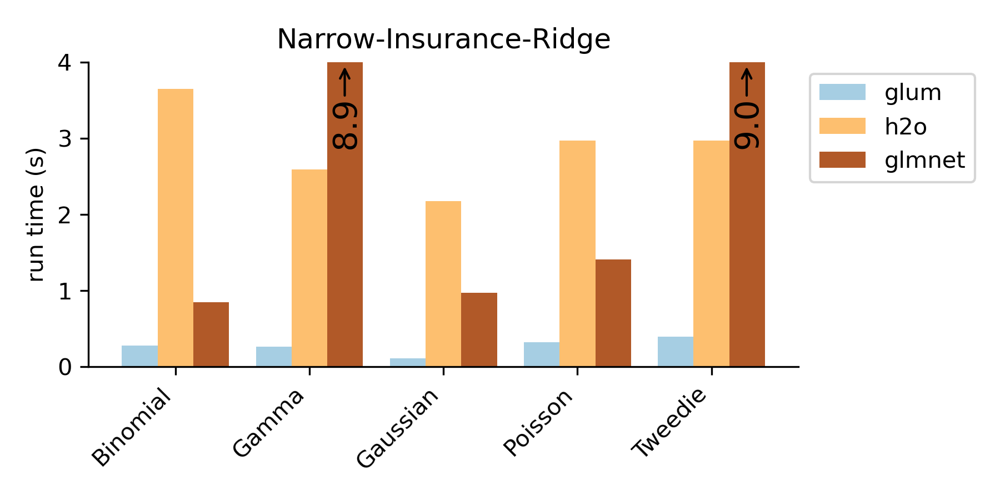
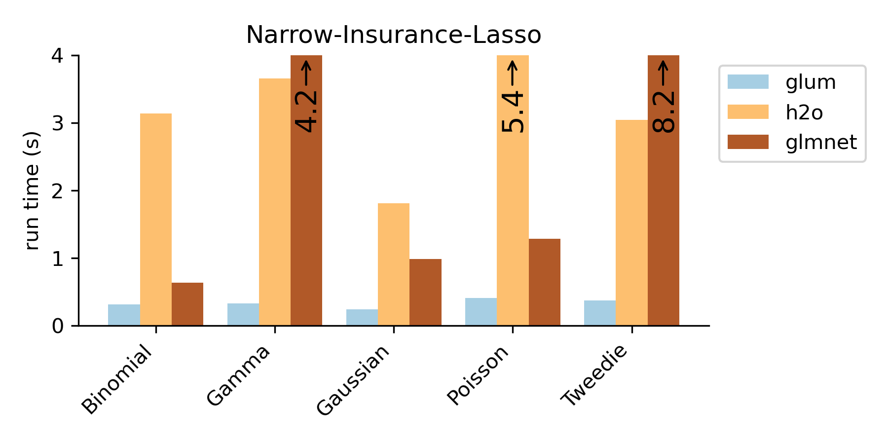
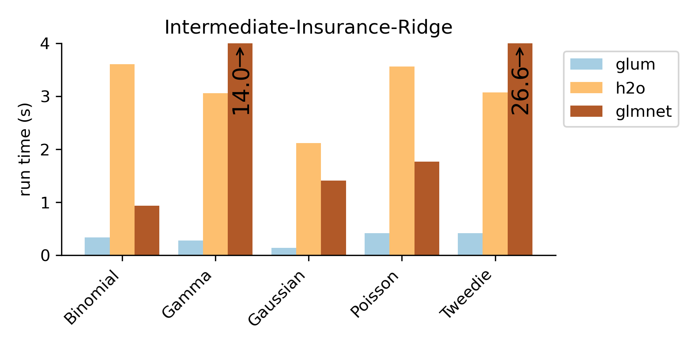
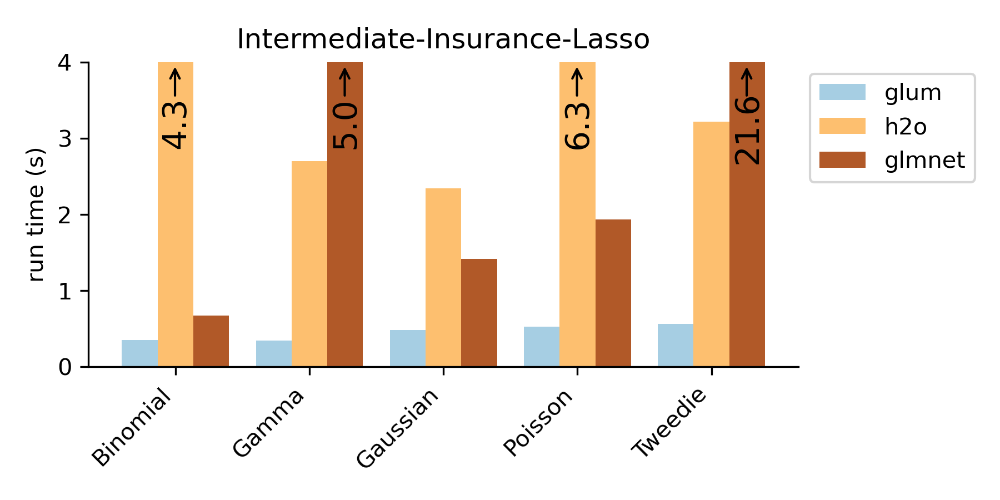
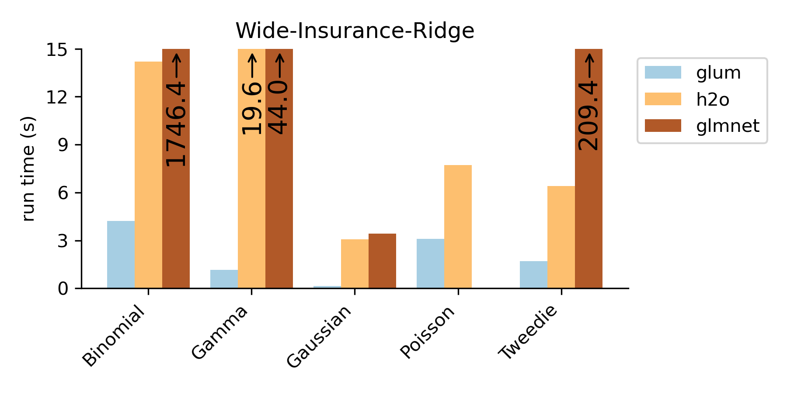
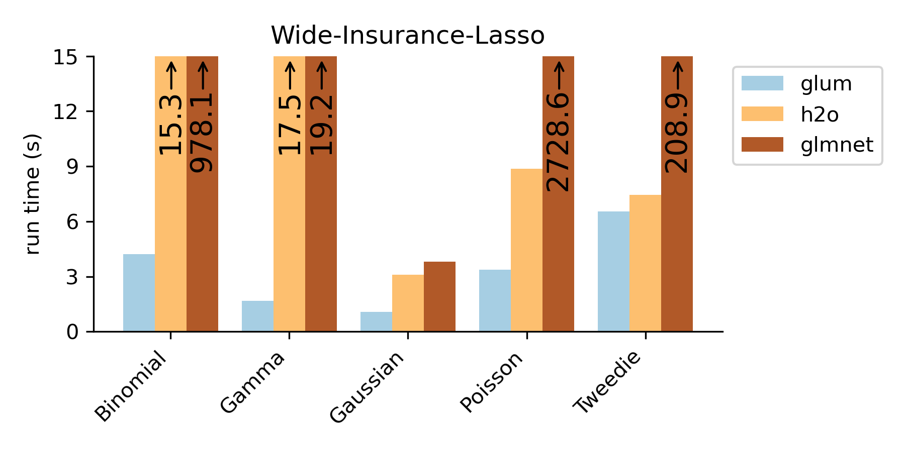
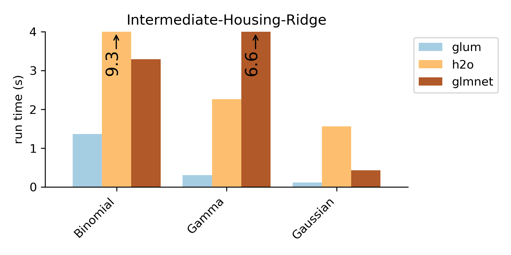
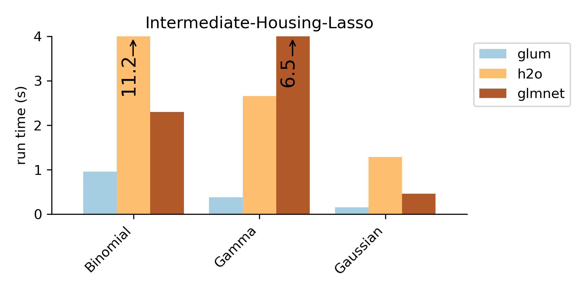

Benchmarks against glmnet and H2O
=================================

The following benchmarks were run on a MacBook Pro laptop with a quad-core Intel Core i5.

The title of each plot refers to both which dataset the benchmark was run on and whether a L2 ridge regression penalty or an L1 lasso penalty was included. For example "Narrow-Insurance-Ridge" was run on the ``narrow-insurance`` dataset with a ridge regression penalty. Each dataset/penalty pair is tested on five distributions that cover most of the common GLM types. The outcome variable is modified appropriately so that the behavior is similar to that expected for the distribution. For example, for the Poisson regression, we predict the number of claims per person. And for the binomial regression, we predict whether any given individual has ever had a claim. For the ``housing`` dataset, we only test three distributions because it does not contain count data that can be used as an outcome.

Note that glum was originally developed to solve problems where N >> K (number of observations is larger than the number of predictors), which is the case for the following benchmarks.

If a bar goes out of the range of the chart, the exact runtime is printed on the bar with an arrow indicating that the bar is truncated.

Note that the ``r-glmnet`` result for the ``wide-insurance-ridge`` Poisson benchmark is missing because ``glmnet`` did not converge after several hours of runtime.

