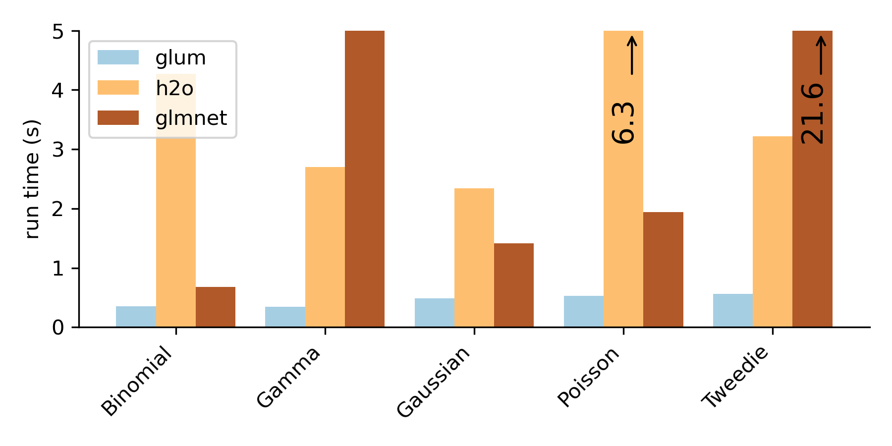

Welcome to glum's documentation!
=========================================

``glum`` is a fast, modern, Python-first GLM estimation library. Generalized linear modeling (GLM) is a core statistical tool that includes many common methods like least-squares regression, Poisson regression and logistic regression as special cases. In addition to fitting basic GLMs, ``glum`` supports a wide range of features. These include:

* Built-in cross validation for optimal regularization, efficiently exploiting a “regularization path”
* L1 and elastic net regularization, which produce sparse and easily interpretable solutions
* L2 regularization, including variable matrix-valued (Tikhonov) penalties, which are useful in modeling correlated effects
* Normal, Poisson, logistic, gamma, and Tweedie distributions, plus varied and customizable link functions
* Dispersion and standard errors
* Box and linear inequality constraints, sample weights, offsets.
* A scikit-learn-like API to fit smoothly into existing workflows.

``glum`` was also built with performance in mind. The following figure shows the runtime of a realistic example using an insurance dataset. For more details and other benchmarks, see the :doc:`Benchmarks<benchmarks>` section.

   
We suggest visiting the :doc:`Installation<install>` and :doc:`Getting Started<getting_started/getting_started>` sections first.

.. toctree::
   :maxdepth: 1

   Installation <install.rst>
   Getting Started <getting_started/getting_started.ipynb>
   Motivation <motivation.rst>
   Benchmarks vs glmnet/H2O <benchmarks.rst>

.. toctree::
   :maxdepth: 2

   Tutorials <tutorials/tutorials.rst>

.. toctree::
   :maxdepth: 1

   Contributing/Development <contributing.rst>
   Algorithmic details <background.ipynb>
   API Reference <glm>
   GitHub <https://github.com/Quantco/glum>
   Changelog <changelog>

:ref:`genindex`
