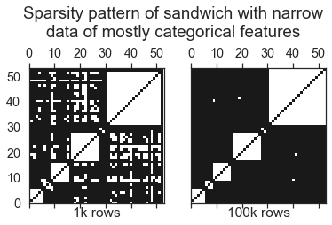
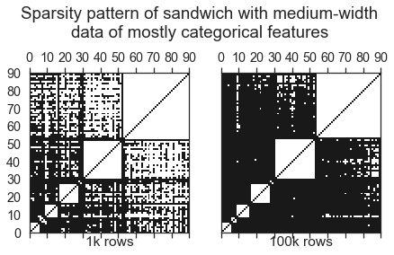
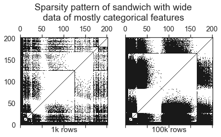

# Efficient matrix representations for working with tabular data

## Use case
Data used in economics, actuarial science, and many other fields is often tabular,
containing rows and columns. Further properties are also common:
- Tabular data often contains categorical data, 
often represented after processing as many columns of indicator values
created by "one-hot encoding."
- It often contains a mix of dense columns and sparse columns, 
perhaps due to one-hot encoding.
- It often is very sparse.

High-performance statistical applications often require fast computation of certain
operations, such as
- Operating on one column at a time
- Computing "sandwich products" of the data, `transpose(X) @ diag(d) @ X`. A sandwich
product shows up in the solution to Weighted Least Squares, as well as in the Hessian
of the likelihood in Generalized Linear Models such as Poisson regression.
- Matrix-vector products

Additionally, it is often desirable to normalize predictors for greater optimizer 
efficiency and numerical stability in
Coordinate Descent and in other machine learning algorithms.

## This library and its design

We designed this library with these use cases in mind. We built this library first for
estimating Generalized Linear Models, but expect it will be useful in a variety of
econometric and statistical use cases. This library was borne out of our need for 
speed, and its unified API is motivated by the annoyance by having to write repeated
checks for which type of matrix-like object you are operating on.

Design principles:
- Speed and memory efficiency are paramount.
- You don't need to sacrifice functionality by using this library: DenseGLMDataMatrix 
and MKLSparseMatrix subclass Numpy arrays and Scipy csc sparse matrices, respectively, 
and inherit their behavior wherever it is not improved on.
- As much as possible, syntax follows Numpy syntax, and dimension-reducing
  operations (like `sum`) return Numpy arrays, following Numpy dimensions
  about the dimensions of results. The aim is to make these classes
  as close as possible to being drop-in replacements for numpy ndarray.
  This is not always possible, however, due to the differing APIs of numpy ndarray
  and scipy sparse.
- Other operations, such as `toarray`, mimic Scipy sparse syntax.
- All matrix classes support matrix products, sandwich products, and `getcol`.
Individual subclasses may support significantly more operations.

## Matrix types
- `DenseGLMDataMatrix` represents dense matrices, subclassing numpy nparray. 
    It additionally supports methods `getcol`, `toarray`, `sandwich`, `standardize`, 
    and `unstandardize`.
- `MKLSparseMatrix` represents column-major sparse data, subclassing 
    `scipy.sparse.csc_matrix`. It additionally supports methods `sandwich`
    and `standardize`, and it's `dot` method (e.g. `@`) calls MKL's sparse dot product
    in the case of matrix-vector products, which is faster.
- `ColScaledSpMat` represents the sum of an n x k sparse matrix and a matrix
    of the form `ones((n, 1)) x shift`, where `shift` is `1 x k`. In other words,
    a matrix with a column-specific shifter applied. Such a matrix is dense, but
    `ColScaledSpMat` represents the sparse matrix and `shift` separately, allowing for
    efficient storage and computations.
- `SplitMatrix` represents matrices with both sparse and dense parts, allowing for
    a significant speedup in matrix multiplications.
    
## Benchmarks
???

## Categorical data
One-hot encoding a feature creates a sparse matrix that has some special properties: 
All of its nonzero elements are ones, and since each element starts a new row, it's `indptr`,
which indicates where rows start and end, will increment by 1 every time.

### Storage
#### csr
```
>>> import numpy as np
>>> from scipy import sparse
>>> import pandas as pd

>>> arr = [1, 0, 1]
>>> dummies = pd.get_dummies(arr)
>>> csr = sparse.csr_matrix(dummies.values)
>>> csr.data
array([1, 1, 1], dtype=uint8)
>>> csr.indices
array([1, 0, 1], dtype=int32)
>>> csr.indptr
array([0, 1, 2, 3], dtype=int32)
```

The size of this matrix, if the original array is of length `n`, is `n` bytes for the 
data (stored as quarter-precision integers), `4n` for `indices`, and `4(n+1)` for 
`indptr`. However, if we know the matrix results from one-hot encoding, we only need to
store the `indices`, so we can reduce memory usage to slightly less than 4/9 of the 
original.

#### csc storage
The case is not quite so simple for csc (column-major) sparse matrices.
However, we still do not need to store the data.

```
>>> import numpy as np
>>> from scipy import sparse
>>> import pandas as pd

>>> arr = [1, 0, 1]
>>> dummies = pd.get_dummies(arr)
>>> csc = sparse.csc_matrix(dummies.values)
>>> csc.data
array([1, 1, 1], dtype=uint8)
>>> csc.indices
array([1, 0, 2], dtype=int32)
>>> csc.indptr
array([0, 1, 3], dtype=int32)
```

### Computations

#### Matrix multiplication

A general sparse CSR matrix-vector products in psedocode,
modeled on [scipy sparse](https://github.com/scipy/scipy/blob/1dc960a33b000b95b1e399582c154efc0360a576/scipy/sparse/sparsetools/csr.h#L1120):
```
>>> def matvec(mat, vec):
>>>     n_row = mat.shape[0]
>>>     res = np.zeros(n_row)
>>>     for i in range(n_row):
>>>         for j in range(mat.indptr[i], mat.indptr[i+1]):
>>>             res[i] += mat.data[j] * vec[mat.indices[j]]
>>>     return res
```
With a CSR categorical matrix, `data` is all 1 and `j` always equals `i`, so we can
simplify this function to be
```
>>> def matvec(mat, vec):
>>>     n_row = mat.shape[0]
>>>     res = np.zeros(n_row)
>>>     for i in range(n_row):
>>>         res[i] = vec[mat.indices[j]]
>>>     return res
```
The original function involved `6N` lookups, `N` multiplications, and `N` additions, 
while the new function involves only `3N` lookups. It thus has the potential to be
significantly faster.
#### sandwich: X.T @ diag(d) @ X





Sandwich products can be computed very efficiently.
```
sandwich(X, d)[i, j] = sum_k X[k, i] d[k] X[k, j]
```
If `i != j`, `sum_k X[k, i] d[k] X[k, j]` = 0. In other words, since
 categorical matrices have only one nonzero per row, the sandwich product is diagonal.
 If `i = j`,
```
sandwich(X, d)[i, j] = sum_k X[k, i] d[k] X[k, i]
= sum_k X[k, i] d[k]
= d[X[:, i]].sum()
= (X.T @ d)[i]
```

So `sandwich(X, d) = diag(X.T @ d)`. This will be especially efficient if `X` is 
available in CSC format. Pseudocode for this sandwich product is
```
res = np.zeros(n_cols)
for i in range(n_cols):
    for j in range(X.indptr[i], X.indptr[i + 1]):
        val += d[indices[j]]
return np.diag(res)
```

This function is ext/categorical/sandwich_categorical

#### Cross-sandwich: X.T @ diag(d) @ Y, Y categorical
If X and Y are different categorical matrices in csr format,
X.T @ diag(d) @ Y is given by
```
res = np.zeros((X.shape[1], Y.shape[1]))
for k in range(len(d)):
    res[X.indices[k], Y.indices[k]] += d[k]
```
So the result will be sparse with at most N elements.
This function is given by `ext/split/_sandwich_cat_cat`.

#### Cross-sandwich: X.T @ diag(d) @ Y, Y dense
```
res = np.zeros((X.shape[1], Y.shape[1]))
for k in range(n_rows):
    for j in range(Y.shape[1]):
        res[X.indices[k], j] += d[k] * Y[k, j]
```
This is `ext/split/sandwich_cat_dense`
